# SafeExchange — Software Design Description (SDD)

> **Chuẩn tham chiếu:** IEEE Std 1016-2009 · ISO/IEC/IEEE 42010  
> **Phiên bản:** 1.0  
> **Ngày:** 2026-04-16  
> **Tác giả:** NGUYEN MINH TUYEN  

---

## Mục lục

1. [Giới thiệu](#1-giới-thiệu)
2. [Tổng quan Hệ thống](#2-tổng-quan-hệ-thống)
3. [Actors](#3-actors)
4. [Sơ đồ Use Case Tổng quan](#4-sơ-đồ-use-case-tổng-quan)
5. [Sơ đồ Use Case Chi tiết](#5-sơ-đồ-use-case-chi-tiết)
6. [Đặc tả Use Case (15 UC)](#6-đặc-tả-use-case)
7. [Sơ đồ Trạng thái Trade](#7-sơ-đồ-trạng-thái-trade)
8. [Sequence Diagrams](#8-sequence-diagrams)
9. [Database ERD](#9-database-erd)
10. [Smart Contract — Class Diagram](#10-smart-contract--class-diagram)
11. [Kiến trúc Hệ thống](#11-kiến-trúc-hệ-thống)
12. [Frontend — Component Tree](#12-frontend--component-tree)
13. [API Design](#13-api-design)
14. [Bảo mật — STRIDE Threat Model](#14-bảo-mật--stride-threat-model)

---

## 1. Giới thiệu

### 1.1 Mục đích

Tài liệu này mô tả thiết kế phần mềm cho **SafeExchange** — nền tảng mua bán Gnosis Safe wallet có escrow on-chain. Tài liệu đóng vai trò **Single Source of Truth** cho mọi AI coding agent và thành viên nhóm phát triển.

### 1.2 Phạm vi

SafeExchange giải quyết bài toán: làm thế nào để buyer và seller thực hiện giao dịch chuyển nhượng Safe wallet một cách **trustless** (không cần tin tưởng lẫn nhau), sử dụng smart contract escrow để đảm bảo:
- ETH chỉ giải ngân khi buyer thực sự là owner mới của Safe (verify on-chain)
- Buyer được hoàn tiền nếu phát hiện Safe thực hiện giao dịch bất thường (nonce tăng)
- Mọi bên đều có bằng chứng on-chain không thể giả mạo

### 1.3 Các thành phần chính

| Layer | Công nghệ |
|-------|-----------|
| Smart Contract | Solidity 0.8.19 — `SafeExchangeEscrow` |
| Blockchain | Ethereum / Sepolia testnet |
| Backend | Express.js + TypeScript |
| Database | PostgreSQL via Drizzle ORM |
| Frontend | React + Wagmi + Viem |
| Real-time | WebSocket (ws) |
| Safe SDK | `@safe-global/protocol-kit` |

---

## 2. Tổng quan Hệ thống

SafeExchange hoạt động theo mô hình **dual-layer verification**:

1. **Off-chain layer** (Express API + PostgreSQL): quản lý trạng thái trade, listing, thông báo real-time
2. **On-chain layer** (Smart Contract): giữ ETH escrow, verify ownership Safe, emit events bất biến

Hai layer đồng bộ qua: frontend gọi contract → lắng nghe event → gọi API cập nhật DB.

---

## 3. Actors

| Actor | Loại | Mô tả |
|-------|------|-------|
| **Seller** | Primary | Chủ sở hữu Gnosis Safe muốn bán. Phải là `owner` của Safe on-chain |
| **Buyer** | Primary | Người muốn mua Safe. Cung cấp ETH escrow |
| **Anyone / Public** | Secondary | Bất kỳ ai có thể gọi `cancelTimeout()` và xem lịch sử |
| **Gnosis Safe** | System | Smart contract Safe — cung cấp `isOwner()`, `nonce()` để verify |
| **SafeExchangeEscrow** | System | Smart contract escrow — giữ ETH, verify, giải ngân |
| **Safe Watcher** | System | Background service theo dõi events on-chain |

---

## 4. Sơ đồ Use Case Tổng quan

> Render bằng VS Code extension **PlantUML by jebbs** hoặc paste vào [kroki.io](https://kroki.io/plantuml)

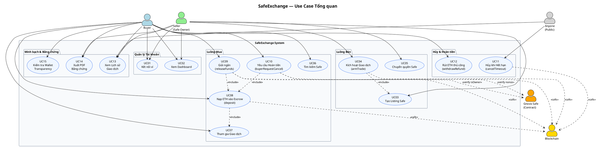

---

## 5. Sơ đồ Use Case Chi tiết

### 5.1 Luồng Bán (Seller)

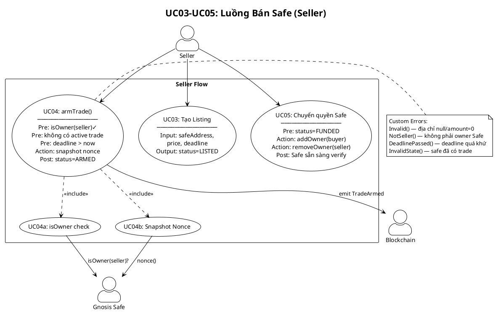

### 5.2 Luồng Mua (Buyer)

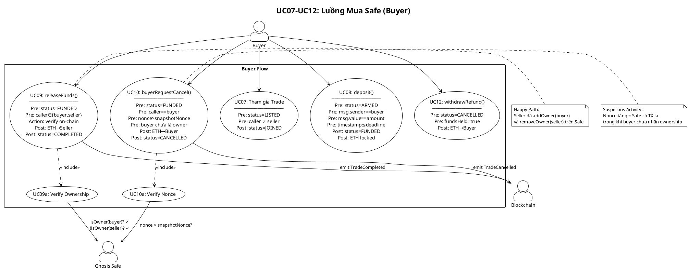

---

## 6. Đặc tả Use Case

### UC01 — Kết nối Ví

| Thuộc tính | Nội dung |
|-----------|---------|
| **ID** | UC01 |
| **Tên** | Kết nối ví (MetaMask / WalletConnect) |
| **Actor** | Seller, Buyer |
| **Mô tả** | Người dùng kết nối ví Web3 để xác thực danh tính bằng địa chỉ Ethereum. Đây là bước bắt buộc trước mọi thao tác giao dịch. |
| **Tiền điều kiện** | Trình duyệt có cài MetaMask hoặc WalletConnect-compatible wallet |
| **Luồng chính** | 1. User click "Connect Wallet" trên Header 2. Modal hiện danh sách ví 3. User chọn ví, approve trong extension 4. Wagmi nhận `address` và `chainId` 5. UI cập nhật trạng thái kết nối 6. Header hiển thị địa chỉ rút gọn |
| **Luồng thay thế** | 3a. User từ chối → modal đóng, không có tác động 4a. Sai network → UI hiển thị cảnh báo "Sai mạng" |
| **Hậu điều kiện** | `address` và `isConnected=true` có sẵn trong Wagmi context |
| **MoSCoW** | **Must Have** |
| **Ghi chú bảo mật** | Không lưu private key. Chỉ dùng địa chỉ public để định danh. |

---

### UC02 — Xem Dashboard

| Thuộc tính | Nội dung |
|-----------|---------|
| **ID** | UC02 |
| **Tên** | Xem Dashboard |
| **Actor** | Seller, Buyer |
| **Mô tả** | Hiển thị tổng quan tất cả trade liên quan đến ví đang kết nối: đang active, đã hoàn thành, đã hủy. |
| **Tiền điều kiện** | UC01 đã hoàn thành (ví đã kết nối) |
| **Luồng chính** | 1. User điều hướng đến `/dashboard` 2. Frontend gọi `GET /api/trades` 3. Lọc trades có `sellerAddress` hoặc `buyerAddress` khớp với ví 4. Hiển thị danh sách với `TradeStatusBadge` 5. WebSocket listener cập nhật real-time khi có thay đổi |
| **Luồng thay thế** | 2a. API lỗi → hiển thị thông báo lỗi, retry button |
| **Hậu điều kiện** | Danh sách trade được render với trạng thái mới nhất |
| **MoSCoW** | **Should Have** |

---

### UC03 — Tạo Listing Safe

| Thuộc tính | Nội dung |
|-----------|---------|
| **ID** | UC03 |
| **Tên** | Tạo Listing Safe (Seller tạo đơn bán) |
| **Actor** | Seller |
| **Mô tả** | Seller điền thông tin Safe muốn bán, đặt giá ETH và deadline, tạo trade record trong DB với status DRAFT → LISTED. |
| **Tiền điều kiện** | UC01 hoàn thành. Seller là owner của Safe address nhập vào. |
| **Luồng chính** | 1. Seller truy cập `/transfer/sell` 2. Nhập `safeAddress`, `priceEth`, `deadline` 3. Frontend validate form (Zod schema) 4. Gọi `POST /api/trades` 5. API kiểm tra không có active trade cho Safe này 6. API tạo trade record `status=LISTED` 7. API emit WebSocket `broadcastNewTrade` 8. UI hiển thị tradeId và bước tiếp theo |
| **Luồng thay thế** | 5a. Safe đã có active trade → API trả 400 "Safe này đang có trade đang hoạt động" 3a. Form không hợp lệ → Zod errors hiển thị inline |
| **Hậu điều kiện** | Trade record tồn tại trong DB với `status=LISTED`, `sellerAddress` = ví Seller |
| **MoSCoW** | **Must Have** |
| **Ghi chú bảo mật** | API không verify on-chain tại bước này. On-chain verify xảy ra ở UC04. |

---

### UC04 — Kích hoạt Giao dịch (armTrade)

| Thuộc tính | Nội dung |
|-----------|---------|
| **ID** | UC04 |
| **Tên** | Kích hoạt Giao dịch on-chain (armTrade) |
| **Actor** | Seller |
| **Mô tả** | Seller gọi `armTrade()` trên smart contract, snapshot nonce của Safe tại thời điểm này làm baseline phát hiện bất thường sau này. Smart contract verify Seller thực sự là owner Safe on-chain. |
| **Tiền điều kiện** | Trade status = `JOINED` (có buyer). Seller đang kết nối ví. |
| **Luồng chính** | 1. Seller click "Kích hoạt" trên Sell page 2. Frontend gọi `armTrade(safeAddress, buyerAddress, amount, deadline)` via Wagmi `writeContractAsync` 3. Smart contract thực thi: &nbsp;&nbsp;3a. Validate không null, amount > 0 &nbsp;&nbsp;3b. `_isOwner(safe, msg.sender)` → verify on-chain &nbsp;&nbsp;3c. `deadline > block.timestamp` &nbsp;&nbsp;3d. `activeTradeBySafe[safe] == 0x0` &nbsp;&nbsp;3e. Snapshot `_safeNonce(safe)` &nbsp;&nbsp;3f. Lưu Trade struct, set `status=ARMED` &nbsp;&nbsp;3g. Emit `TradeArmed(tradeId, buyer, seller, safe, amount, deadline, nonce)` 4. Frontend lắng nghe event, lấy `tradeId` 5. Gọi `POST /api/trades/:id/arm` với `onchainTradeId`, `snapshotNonce` 6. DB cập nhật `status=ARMED` |
| **Luồng thay thế** | 3b. `NotSeller()` → revert, UI thông báo "Bạn không phải owner Safe này" 3c. `DeadlinePassed()` → revert 3d. `InvalidState()` → revert, Safe đã có active trade |
| **Hậu điều kiện** | On-chain: `trades[tradeId].status = ARMED`, nonce được snapshot. Off-chain: DB `status=ARMED`, `onchainTradeId` được lưu. |
| **MoSCoW** | **Must Have** |
| **Ghi chú bảo mật** | STRIDE — Spoofing: `isOwner()` on-chain ngăn giả mạo Seller. Tampering: `activeTradeBySafe` lock ngăn double-arm. |

---

### UC05 — Chuyển Quyền Safe cho Buyer

| Thuộc tính | Nội dung |
|-----------|---------|
| **ID** | UC05 |
| **Tên** | Chuyển quyền sở hữu Safe cho Buyer |
| **Actor** | Seller (thực hiện trực tiếp trên Gnosis Safe) |
| **Mô tả** | Sau khi Buyer deposit ETH (UC08), Seller thực hiện thao tác trên Gnosis Safe để `addOwner(buyer)` và `removeOwner(seller)`. Đây là bước off-chain Safe, không qua SafeExchange contract nhưng là điều kiện tiên quyết để UC09 thành công. |
| **Tiền điều kiện** | Trade status = `FUNDED`. Buyer đã lock ETH. |
| **Luồng chính** | 1. Seller truy cập app.safe.global 2. Thực hiện Safe transaction: `addOwner(buyerAddress)` 3. Sau khi confirm: `removeOwner(sellerAddress)` 4. Safe nonce tăng lên (bình thường) 5. Seller thông báo Buyer đã có thể gọi `releaseFunds()` |
| **Luồng thay thế** | 4a. Nếu Seller thực hiện TX khác (không phải transfer ownership) → nonce tăng + buyer chưa là owner → Buyer có thể gọi UC10 |
| **Hậu điều kiện** | On Safe: `isOwner(buyer)=true`, `isOwner(seller)=false`. |
| **MoSCoW** | **Must Have** |
| **Ghi chú bảo mật** | Đây là điểm then chốt của toàn bộ hệ thống. Smart contract verify trạng thái này on-chain tại UC09. |

---

### UC06 — Tìm kiếm & Xem Danh sách Safe

| Thuộc tính | Nội dung |
|-----------|---------|
| **ID** | UC06 |
| **Tên** | Tìm kiếm và xem danh sách Safe đang bán |
| **Actor** | Buyer, Anyone |
| **Mô tả** | Người dùng tìm kiếm trade bằng trade ID hoặc địa chỉ Safe, xem thông tin chi tiết trước khi quyết định mua. |
| **Tiền điều kiện** | Không cần đăng nhập để xem (chỉ cần kết nối ví để thực hiện hành động) |
| **Luồng chính** | 1. User nhập từ khóa vào ô tìm kiếm trên Buy page 2. Gọi `GET /api/trades/search?q=<query>` 3. API tìm theo `id` trước, sau đó `safeAddress` nếu bắt đầu bằng `0x` 4. Hiển thị thông tin: giá, deadline, seller address, trạng thái 5. User xem Wallet Transparency (UC15) để kiểm tra lịch sử Safe |
| **Luồng thay thế** | 3a. Không tìm thấy → 404 "Không tìm thấy trade" |
| **Hậu điều kiện** | User có đủ thông tin để quyết định tham gia (UC07) |
| **MoSCoW** | **Must Have** |

---

### UC07 — Tham gia Giao dịch

| Thuộc tính | Nội dung |
|-----------|---------|
| **ID** | UC07 |
| **Tên** | Tham gia Giao dịch (Buyer join) |
| **Actor** | Buyer |
| **Mô tả** | Buyer xác nhận muốn mua Safe, đăng ký địa chỉ ví vào trade. Bước này là off-chain, cần thiết để Seller biết gọi `armTrade()` với buyer address nào. |
| **Tiền điều kiện** | UC01 hoàn thành. Trade `status=LISTED`. `buyer ≠ seller`. |
| **Luồng chính** | 1. Buyer click "Tham gia giao dịch" trên Buy page 2. Gọi `POST /api/trades/:id/join` với `buyerAddress` 3. API kiểm tra `status == LISTED` 4. API kiểm tra `buyer ≠ seller` 5. Cập nhật `status=JOINED`, lưu `buyerAddress` 6. Emit WebSocket notification cho Seller 7. Buyer chờ Seller gọi UC04 |
| **Luồng thay thế** | 3a. `status ≠ LISTED` → 400 "Trade không ở trạng thái có thể tham gia" 4a. Buyer là Seller → 400 "Seller không thể tự mua" |
| **Hậu điều kiện** | `trade.buyerAddress` = buyer wallet, `status=JOINED`. Seller nhận notification. |
| **MoSCoW** | **Must Have** |

---

### UC08 — Nạp ETH vào Escrow (deposit)

| Thuộc tính | Nội dung |
|-----------|---------|
| **ID** | UC08 |
| **Tên** | Nạp ETH vào Escrow — `deposit()` |
| **Actor** | Buyer |
| **Mô tả** | Buyer gửi đúng số ETH theo giá thỏa thuận vào smart contract escrow. ETH bị lock cho đến khi trade hoàn thành hoặc bị hủy. |
| **Tiền điều kiện** | Trade on-chain `status=ARMED`. `msg.sender == trade.buyer`. Ví Buyer có đủ ETH. |
| **Luồng chính** | 1. Buyer click "Gửi ký quỹ" trên Buy page 2. Hiển thị số ETH cần gửi để confirm 3. Wagmi gọi `deposit(tradeId)` với `{value: amount}` 4. Smart contract kiểm tra: &nbsp;&nbsp;4a. `status == ARMED` &nbsp;&nbsp;4b. `msg.sender == t.buyer` &nbsp;&nbsp;4c. `msg.value == t.amount` (exact match) &nbsp;&nbsp;4d. `block.timestamp <= t.deadline` 5. Set `status=FUNDED`, `fundsHeld=true` 6. Emit `TradeFunded(tradeId, buyer, amount)` 7. Frontend cập nhật API `POST /api/trades/:id/deposit` |
| **Luồng thay thế** | 4b. `NotBuyer()` → revert 4c. `Invalid()` → revert, sai số ETH 4d. `DeadlinePassed()` → revert |
| **Hậu điều kiện** | ETH bị lock trong contract. `trade.fundsHeld=true`. `status=FUNDED` cả on-chain và DB. |
| **MoSCoW** | **Must Have** |
| **Ghi chú bảo mật** | `nonReentrant` modifier ngăn reentrancy attack. Exact amount check ngăn underpay/overpay. |

---

### UC09 — Giải ngân (releaseFunds)

| Thuộc tính | Nội dung |
|-----------|---------|
| **ID** | UC09 |
| **Tên** | Giải ngân ETH cho Seller — `releaseFunds()` |
| **Actor** | Buyer hoặc Seller (ai cũng có thể trigger) |
| **Mô tả** | Sau khi Seller đã chuyển quyền Safe (UC05), bất kỳ bên nào gọi `releaseFunds()`. Smart contract tự verify on-chain: `isOwner(buyer)=true` VÀ `isOwner(seller)=false` → giải ngân ETH cho Seller. Không cần tin tưởng bất kỳ ai. |
| **Tiền điều kiện** | Trade on-chain `status=FUNDED`. `fundsHeld=true`. `isOwner(buyer)=true`. `isOwner(seller)=false`. |
| **Luồng chính** | 1. Buyer (hoặc Seller) click "Xác nhận hoàn tất" 2. Wagmi gọi `releaseFunds(tradeId)` 3. Smart contract kiểm tra: &nbsp;&nbsp;3a. `status == FUNDED` &nbsp;&nbsp;3b. `msg.sender ∈ {buyer, seller}` &nbsp;&nbsp;3c. `fundsHeld == true` 4. Gọi `_isOwner(safe, buyer)` → `true` 5. Gọi `_isOwner(safe, seller)` → `false` 6. Set `status=COMPLETED`, `fundsHeld=false` 7. Xóa `activeTradeBySafe[safe]` 8. `seller.call{value: amount}("")` — transfer ETH 9. Emit `TradeCompleted` 10. API cập nhật `status=COMPLETED` |
| **Luồng thay thế** | 4a. `isOwner(buyer)=false` → `require()` revert "Buyer chua la owner cua Safe" 5a. `isOwner(seller)=true` → `require()` revert "Seller van con la owner cua Safe" 8a. Transfer thất bại → `revert TransferFailed()` |
| **Hậu điều kiện** | ETH đã về ví Seller. `status=COMPLETED`. `activeTradeBySafe[safe]=0x0`. |
| **MoSCoW** | **Must Have** |
| **Ghi chú bảo mật** | STRIDE — Elevation of Privilege: on-chain dual ownership check không thể bypass. Repudiation: `TradeCompleted` event trên blockchain là bằng chứng bất biến. |

---

### UC10 — Yêu cầu Hoàn tiền (buyerRequestCancel)

| Thuộc tính | Nội dung |
|-----------|---------|
| **ID** | UC10 |
| **Tên** | Yêu cầu Hoàn tiền khi phát hiện bất thường — `buyerRequestCancel()` |
| **Actor** | Buyer |
| **Mô tả** | Trong trạng thái FUNDED, nếu Buyer phát hiện Safe thực hiện giao dịch bất thường (nonce tăng so với snapshot) nhưng Buyer chưa được thêm làm owner, Buyer có thể yêu cầu hủy và hoàn tiền ngay lập tức. |
| **Tiền điều kiện** | Trade `status=FUNDED`. `msg.sender == buyer`. |
| **Luồng chính** | 1. Buyer click "Báo giao dịch bất thường" (hoặc hệ thống auto-detect) 2. Wagmi gọi `buyerRequestCancel(tradeId)` 3. Smart contract kiểm tra: &nbsp;&nbsp;3a. `status == FUNDED` &nbsp;&nbsp;3b. `msg.sender == t.buyer` &nbsp;&nbsp;3c. Nếu `isOwner(buyer) && !isOwner(seller)` → `revert TradeAlreadyCompleted()` (trade thực ra đã xong) &nbsp;&nbsp;3d. `_safeNonce(safe) > t.snapshotNonce` → có TX bất thường 4. Gọi `_cancel(id, "SUSPICIOUS_ACTIVITY")` 5. Transfer ETH về Buyer 6. Emit `TradeCancelled(reason="SUSPICIOUS_ACTIVITY")` 7. API cập nhật `status=CANCELLED` |
| **Luồng thay thế** | 3c. `TradeAlreadyCompleted()` → transfer ownership đã đúng, Buyer nên gọi UC09 3d. `NoSuspiciousActivity()` → nonce chưa thay đổi, chưa có bằng chứng bất thường |
| **Hậu điều kiện** | ETH về Buyer. `status=CANCELLED`. |
| **MoSCoW** | **Must Have** |
| **Ghi chú bảo mật** | Đây là cơ chế bảo vệ cốt lõi của SafeExchange. Nonce snapshot tại `armTrade` là baseline. Bất kỳ TX nào trên Safe sau đó đều có thể bị phát hiện. |

---

### UC11 — Hủy khi Hết hạn (cancelTimeout)

| Thuộc tính | Nội dung |
|-----------|---------|
| **ID** | UC11 |
| **Tên** | Hủy Giao dịch khi hết Deadline — `cancelTimeout()` |
| **Actor** | Anyone (bất kỳ ai — permissionless) |
| **Mô tả** | Sau khi deadline đã qua, bất kỳ địa chỉ nào cũng có thể gọi `cancelTimeout()` để hủy trade và trả ETH về Buyer (nếu đã deposit). Thiết kế permissionless đảm bảo không ai có thể "giữ con tin" ETH vĩnh viễn. |
| **Tiền điều kiện** | Trade `status ∈ {ARMED, FUNDED}`. `block.timestamp > deadline`. |
| **Luồng chính** | 1. Bot/user gọi `cancelTimeout(tradeId)` 2. Kiểm tra `status ∈ {ARMED, FUNDED}` 3. Kiểm tra `block.timestamp > t.deadline` 4. Gọi `_cancel(id, "TIMEOUT")` 5. Nếu `fundsHeld=true` → transfer ETH về Buyer 6. Emit `TradeCancelled(reason="TIMEOUT")` 7. Safe Watcher phát hiện event → API cập nhật `status=CANCELLED` |
| **Luồng thay thế** | 3a. `block.timestamp <= deadline` → `revert InvalidState()` |
| **Hậu điều kiện** | Trade hủy. ETH về Buyer nếu đã deposit. |
| **MoSCoW** | **Must Have** |
| **Ghi chú bảo mật** | Permissionless design ngăn Seller ghim ETH vô thời hạn. |

---

### UC12 — Rút ETH thủ công (withdrawRefund)

| Thuộc tính | Nội dung |
|-----------|---------|
| **ID** | UC12 |
| **Tên** | Rút ETH thủ công sau khi bị hủy — `withdrawRefund()` |
| **Actor** | Buyer |
| **Mô tả** | Pull-pattern fallback: nếu vì lý do nào đó ETH chưa được tự động hoàn (ví dụ `_cancel()` không kèm transfer), Buyer có thể chủ động rút ETH về. |
| **Tiền điều kiện** | Trade `status=CANCELLED`. `fundsHeld=true`. |
| **Luồng chính** | 1. Buyer gọi `withdrawRefund(tradeId)` 2. Kiểm tra `status == CANCELLED` 3. Kiểm tra `fundsHeld == true` 4. Set `fundsHeld=false` 5. Transfer ETH về Buyer |
| **Luồng thay thế** | 2a. `status ≠ CANCELLED` → `revert InvalidState()` 3a. `fundsHeld=false` → `revert InvalidState()` (đã rút rồi) |
| **Hậu điều kiện** | ETH về Buyer. `fundsHeld=false`. |
| **MoSCoW** | **Should Have** |
| **Ghi chú bảo mật** | Pull-pattern tránh reentrancy. `nonReentrant` modifier vẫn được áp dụng. |

---

### UC13 — Xem Lịch sử Giao dịch

| Thuộc tính | Nội dung |
|-----------|---------|
| **ID** | UC13 |
| **Tên** | Xem Lịch sử Giao dịch và System Logs |
| **Actor** | Seller, Buyer, Anyone |
| **Mô tả** | Hiển thị toàn bộ lịch sử trades, system logs và events liên quan. Hỗ trợ lọc theo địa chỉ ví, trạng thái, thời gian. |
| **Tiền điều kiện** | Không bắt buộc kết nối ví (dữ liệu public) |
| **Luồng chính** | 1. User điều hướng đến Dashboard 2. Gọi `GET /api/trades` (toàn bộ hoặc filter) 3. Gọi `GET /api/logs` để lấy system logs 4. Hiển thị timeline với `TradeStatusBadge` 5. Real-time update qua WebSocket |
| **Hậu điều kiện** | User xem được toàn bộ lịch sử |
| **MoSCoW** | **Should Have** |

---

### UC14 — Xuất PDF Bằng chứng

| Thuộc tính | Nội dung |
|-----------|---------|
| **ID** | UC14 |
| **Tên** | Xuất PDF Bằng chứng Giao dịch |
| **Actor** | Seller, Buyer |
| **Mô tả** | Tạo file PDF chứa toàn bộ thông tin trade, on-chain transaction hashes, evidence signatures để làm bằng chứng pháp lý hoặc lưu trữ cá nhân. |
| **Tiền điều kiện** | Trade tồn tại trong DB. UC01 hoàn thành. |
| **Luồng chính** | 1. User click "Xuất PDF" 2. Frontend gọi `lib/export-pdf.ts` 3. Tổng hợp: trade info, `onchainTradeId`, `snapshotNonce`, `evidence` records, `systemLogs` 4. Render PDF qua thư viện client-side 5. Trigger download |
| **Hậu điều kiện** | File PDF được lưu về máy |
| **MoSCoW** | **Could Have** |

---

### UC15 — Kiểm tra Wallet Transparency

| Thuộc tính | Nội dung |
|-----------|---------|
| **ID** | UC15 |
| **Tên** | Kiểm tra Wallet Transparency — Lịch sử Safe |
| **Actor** | Buyer, Anyone |
| **Mô tả** | Buyer xem toàn bộ lịch sử giao dịch của Safe address (qua Etherscan hoặc Safe Transaction Service API) trước khi quyết định mua, để đánh giá rủi ro. |
| **Tiền điều kiện** | Có địa chỉ Safe cần kiểm tra |
| **Luồng chính** | 1. Buyer điều hướng đến trang Wallet Transparency 2. Nhập hoặc tự động load `safeAddress` 3. Fetch lịch sử từ Safe Transaction Service hoặc on-chain 4. Hiển thị: số lượng TX, owners hiện tại, balance, modules 5. Buyer đánh giá trước khi join (UC07) |
| **Hậu điều kiện** | Buyer có thông tin đầy đủ để ra quyết định |
| **MoSCoW** | **Could Have** |
| **Ghi chú bảo mật** | Giúp Buyer phát hiện Safe có lịch sử đáng ngờ trước khi commit ETH. |

---

## 7. Sơ đồ Trạng thái Trade

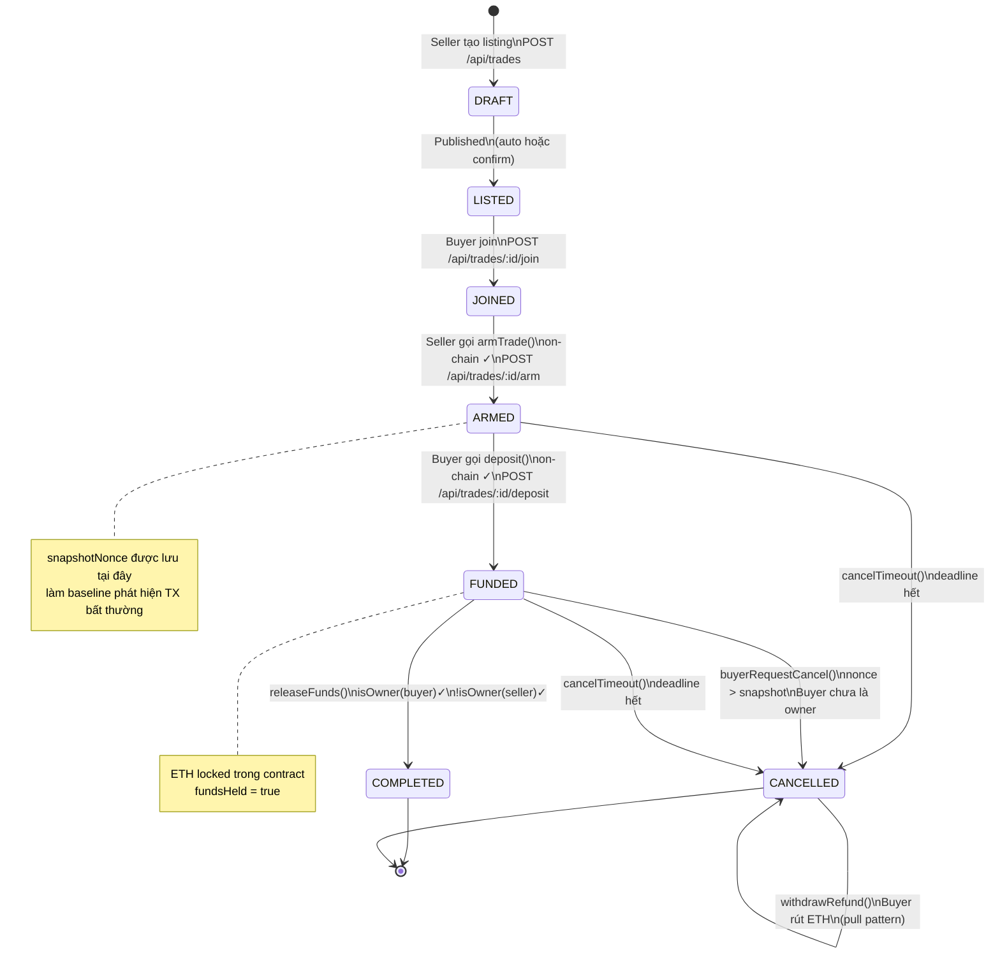

---

## 8. Sequence Diagrams

### 8.1 Happy Path — Giao dịch thành công

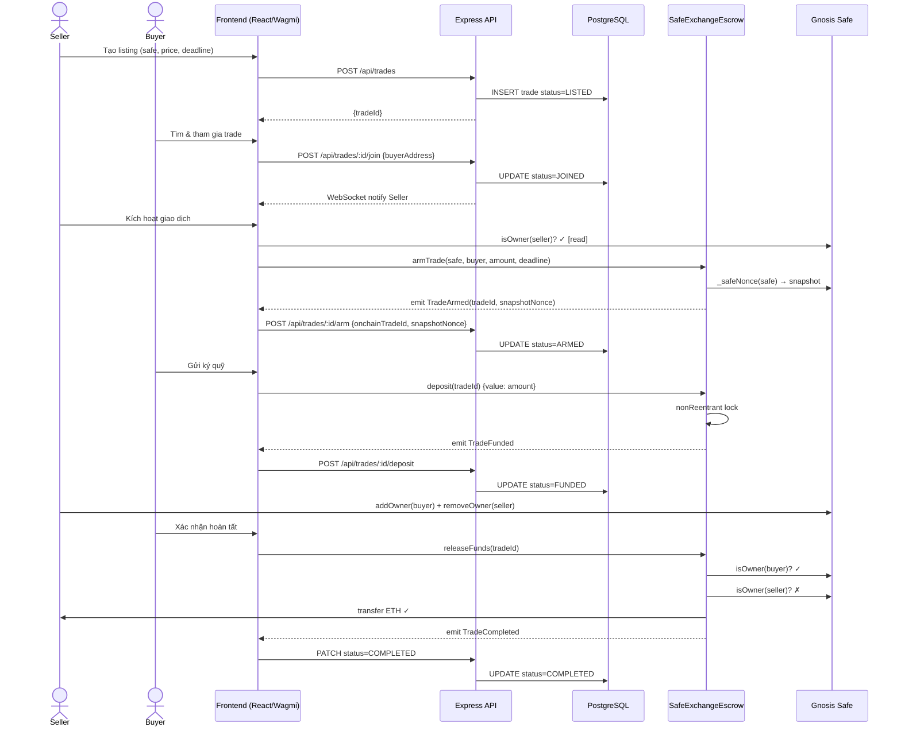

### 8.2 Cancel Path — Phát hiện bất thường (buyerRequestCancel)

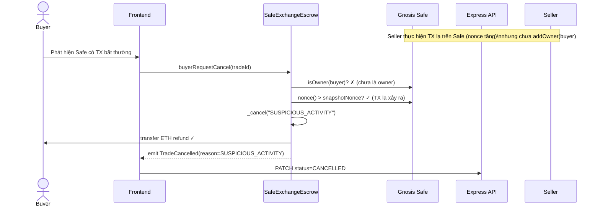

### 8.3 Cancel Path — Timeout (cancelTimeout)

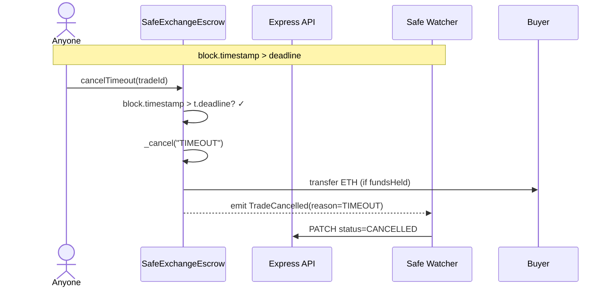

---

## 9. Database ERD

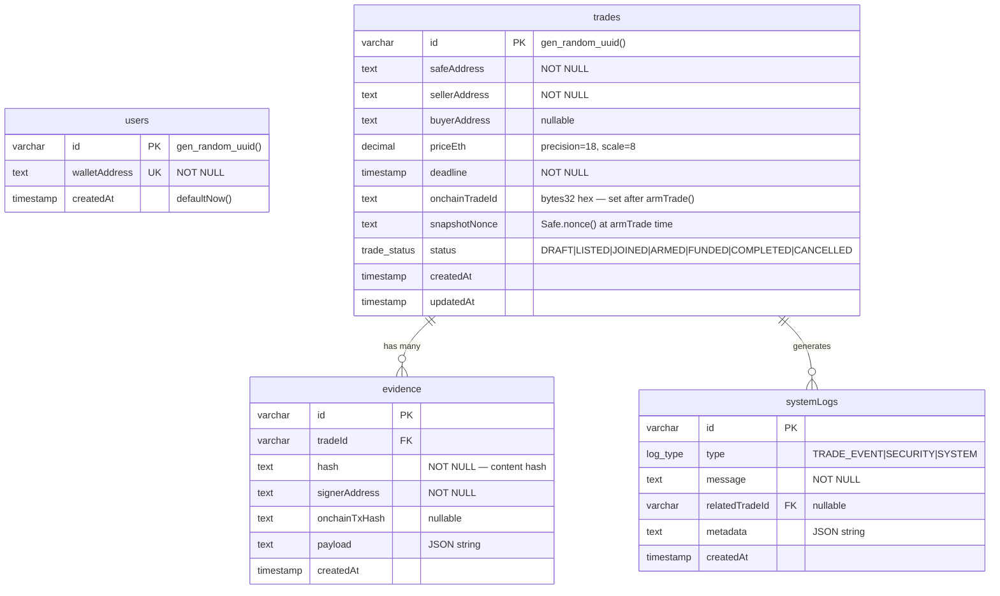

---

## 10. Smart Contract — Class Diagram

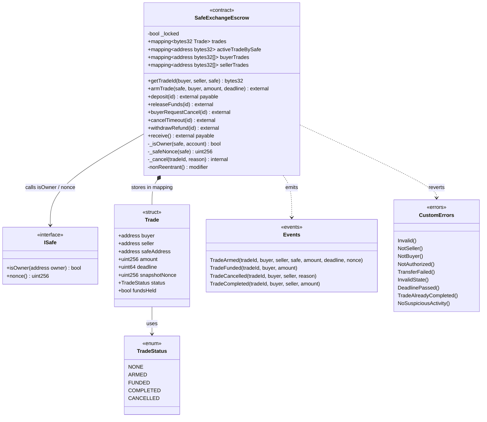

---

## 11. Kiến trúc Hệ thống

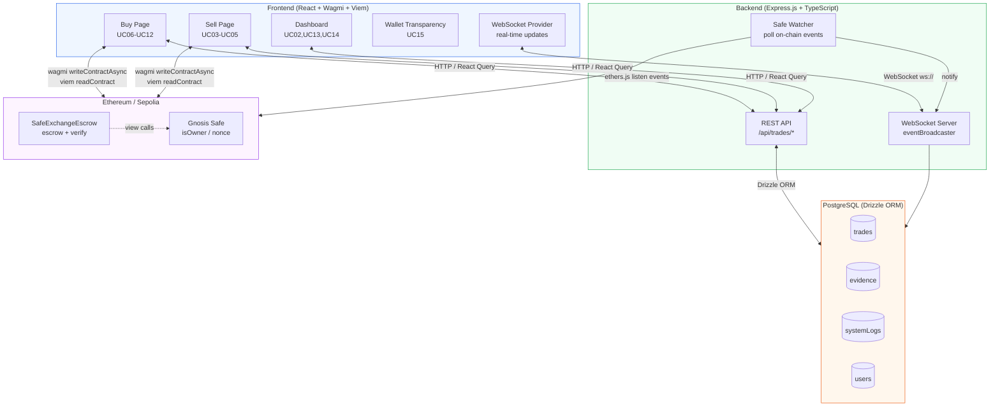

---

## 12. Frontend — Component Tree

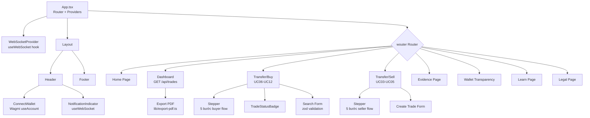

---

## 13. API Design

### 13.1 Endpoints

| Method | Path | Actor | Mô tả | UC |
|--------|------|-------|-------|-----|
| GET | `/api/trades` | Anyone | Lấy tất cả trades | UC13 |
| GET | `/api/trades/search?q=` | Anyone | Tìm theo id hoặc safeAddress | UC06 |
| GET | `/api/trades/:id` | Anyone | Chi tiết trade | UC06 |
| POST | `/api/trades` | Seller | Tạo trade mới | UC03 |
| POST | `/api/trades/:id/join` | Buyer | Buyer tham gia | UC07 |
| POST | `/api/trades/:id/arm` | Seller | Cập nhật sau armTrade() | UC04 |
| POST | `/api/trades/:id/deposit` | Buyer | Cập nhật sau deposit() | UC08 |
| POST | `/api/trades/:id/complete` | Buyer/Seller | Cập nhật sau releaseFunds() | UC09 |
| POST | `/api/trades/:id/cancel` | System | Cập nhật khi cancel | UC10,UC11 |
| POST | `/api/evidence` | Buyer/Seller | Lưu bằng chứng có chữ ký | UC14 |
| GET | `/api/logs` | Anyone | Lấy system logs | UC13 |

### 13.2 WebSocket Events

| Event | Direction | Payload | Trigger |
|-------|-----------|---------|---------|
| `new_trade` | Server→Client | `{trade}` | POST /api/trades |
| `trade_update` | Server→Client | `{tradeId, status, data}` | Bất kỳ status change |
| `notification` | Server→Client | `{title, message, type}` | Mọi sự kiện quan trọng |

---

## 14. Bảo mật — STRIDE Threat Model

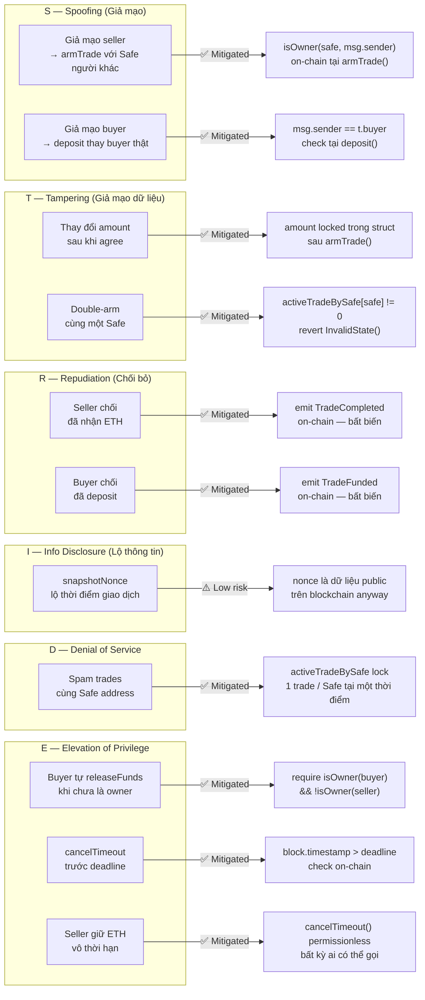

### 14.1 Checklist Bảo mật

| Hạng mục | Trạng thái | Ghi chú |
|---------|-----------|---------|
| Reentrancy Guard | ✅ | `nonReentrant` modifier trên deposit, releaseFunds, buyerRequestCancel, cancelTimeout, withdrawRefund |
| Integer Overflow | ✅ | Solidity 0.8.x built-in checked arithmetic |
| Access Control | ✅ | `msg.sender` checks trên mọi hàm public |
| On-chain Verification | ✅ | `isOwner()` và `nonce()` được gọi trực tiếp từ contract |
| Pull over Push | ✅ | `withdrawRefund()` dùng pull pattern |
| Event Logging | ✅ | Mọi state change đều emit event |
| Exact Amount Check | ✅ | `msg.value != t.amount` → revert |
| Deadline Enforcement | ✅ | `block.timestamp` check cả on-chain |
| No Selfdestruct | ✅ | Contract không có `selfdestruct` |
| OWASP A01 Broken Access | ✅ | Verify trên blockchain, không phụ thuộc DB |

---

> **Lưu ý cho AI Coding Agents:** Tài liệu này là Single Source of Truth. Trước khi thay đổi bất kỳ thành phần nào, kiểm tra cross-reference với UC specification tương ứng và đảm bảo state machine transitions ở Mục 7 vẫn nhất quán.
