# Sơ Đồ Phân Rã Chức Năng

Trả lời câu hỏi: **Hệ thống gồm những mảng chức năng nào?**

> Seller và Buyer là hai **vai trò** của cùng một người dùng — cùng ví, nhưng đứng ở góc khác nhau trong từng giao dịch. Sơ đồ Use Case tổng quát gộp chung thành "Người dùng"; sơ đồ này làm rõ vai trò từng chức năng.

```mermaid
graph TD
    Root["WebSafeExchange"]

    Root --> A["Quản lý tài khoản"]
    Root --> B["Quản lý giao dịch Safe"]
    Root --> C["Giám sát blockchain"]
    Root --> D["Diễn đàn cộng đồng"]
    Root --> E["Tra cứu Safe on-chain"]
    Root --> F["Thông báo real-time"]

    A --> A1["Kết nối ví MetaMask"]
    A --> A2["Cập nhật tên hiển thị"]
    A --> A3["Xem hồ sơ & lịch sử giao dịch"]

    B --> B1["[Seller] Đăng bán Safe\n(tạo listing, ký xác thực EIP-191)"]
    B --> B2["[Buyer] Tham gia giao dịch\n(ký xác thực EIP-191)"]
    B --> B3["[Seller] Arm giao dịch on-chain\n(gọi Escrow Contract, snapshot nonce)"]
    B --> B4["[Buyer] Nộp ký quỹ ETH\n(deposit vào Escrow Contract)"]
    B --> B5["[Seller] Chuyển ownership Safe\n(execTransaction on-chain)"]
    B --> B6["[Seller / Buyer] Xác nhận hoàn tất\n(Escrow giải phóng ETH)"]
    B --> B7["[Seller / Buyer] Hủy giao dịch\n(Escrow hoàn ETH)"]
    B --> B8["Tìm kiếm giao dịch / Safe"]

    C --> C1["Subscribe ExecutionSuccess\n(Gnosis Safe — mỗi Safe 1 subscription)"]
    C --> C2["Kiểm tra isOwner & nonce\n(readContract qua HTTP RPC)"]
    C --> C3["Phát hiện ownership transfer\nthành công"]
    C --> C4["Phát hiện hoạt động bất thường\n(nonce tăng, buyer chưa là owner)"]
    C --> C5["Subscribe escrow contract events\n(TradeArmed / Completed / Cancelled)"]

    D --> D1["Đăng bài bán Safe"]
    D --> D2["Đăng bài tìm mua"]
    D --> D3["Thảo luận & hỏi đáp"]
    D --> D4["Bình luận\n(hỗ trợ reply lồng nhau)"]
    D --> D5["Xem & lọc bài đăng theo loại"]

    E --> E1["Xem owners & threshold"]
    E --> E2["Xem nonce hiện tại"]

    F --> F1["Broadcast cập nhật trạng thái trade\n(WebSocket — tất cả client)"]
    F --> F2["Gửi thông báo đích danh\n(theo địa chỉ ví đã đăng ký)"]
```



## Ghi chú vòng đời giao dịch

```
DRAFT → LISTED → JOINED → ARMED → FUNDED → COMPLETED
                                         ↘ CANCELLED (bất kỳ giai đoạn nào trước COMPLETED)
```

| Trạng thái | Ai kích hoạt | Ghi chú |
|-----------|-------------|---------|
| LISTED | Seller tạo trade | Seller ký EIP-191 |
| JOINED | Buyer tham gia | Buyer ký EIP-191 |
| ARMED | Seller arm on-chain | Escrow Contract + snapshot nonce |
| FUNDED | Buyer deposit | Escrow nhận ETH, Safe Watcher bắt đầu watch |
| COMPLETED | Buyer xác nhận | Sau khi Watcher phát hiện ownership transfer OK |
| CANCELLED | Seller hoặc Buyer | Escrow hoàn ETH |
