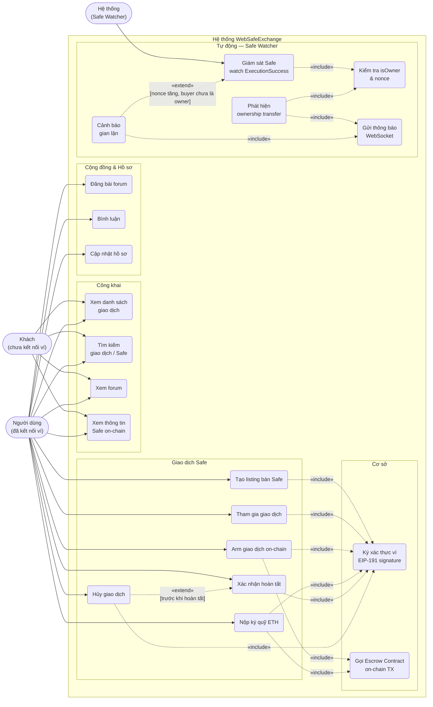

# Sơ Đồ Use Case Tổng Quát

Trả lời câu hỏi: **Ai dùng hệ thống và họ làm được gì?**

> Seller và Buyer được gộp chung thành **Người dùng** trong sơ đồ này — cùng một ví, đóng vai trò khác nhau tùy từng giao dịch. Xem [00-decomposition.md](./00-decomposition.md) để biết chức năng nào thuộc về vai trò nào.

## Ghi chú

| Quan hệ | Ý nghĩa trong hệ thống |
|---------|----------------------|
| `«include»` UCB1 | Mọi thao tác ghi đều yêu cầu chữ ký EIP-191 để xác thực quyền sở hữu ví |
| `«include»` UCB2 | Arm và Deposit đòi hỏi giao dịch on-chain trực tiếp với Escrow Contract |
| `«extend»` UC10 → UC9 | Buyer hoặc Seller có thể hủy thay vì xác nhận hoàn tất (trước khi trade COMPLETED) |
| `«extend»` UCW4 → UCW1 | Cảnh báo gian lận chỉ kích hoạt khi nonce Safe tăng mà buyer chưa thành owner |
