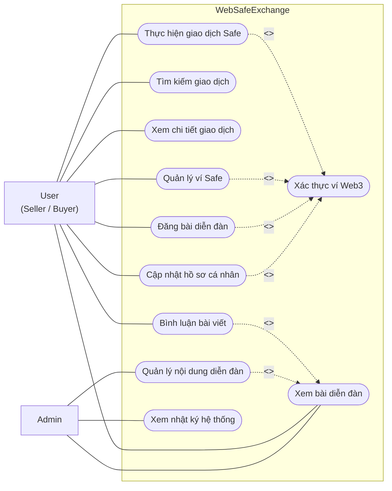
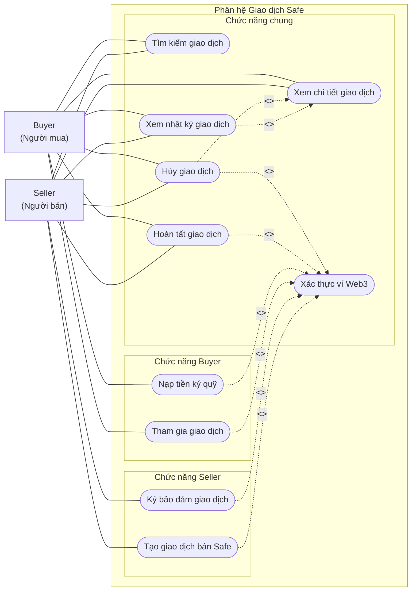
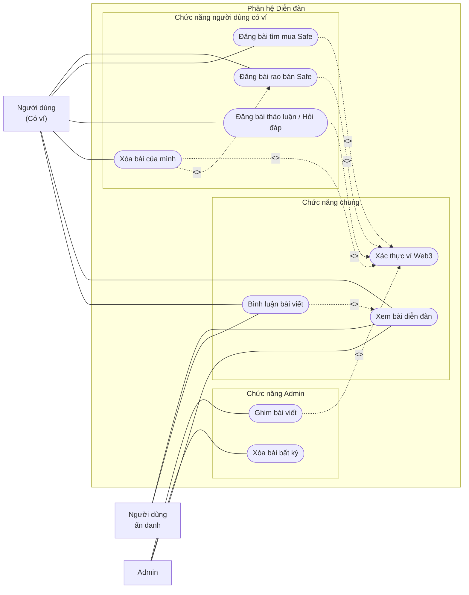
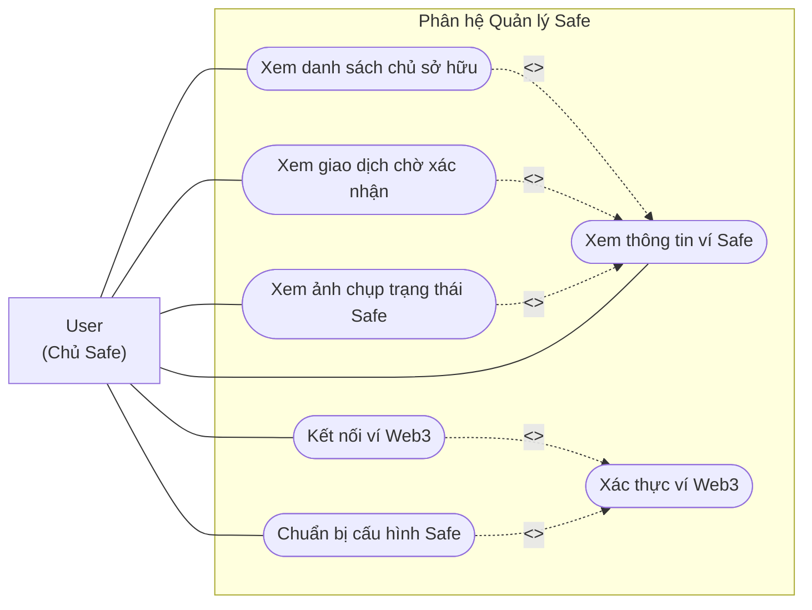

# Use Case Diagrams — WebSafeExchange

> Actor được biểu diễn bằng hình chữ nhật, use case bằng hình bầu dục `([...])` — tương thích với mọi phiên bản Mermaid.

---

## 1. Sơ đồ Use Case Tổng quan

> Seller và Buyer được gộp thành **User**. Chi tiết vai trò xem ở phần phân rã bên dưới.

---

## 2. Phân rã: Phân hệ Giao dịch Safe

---

## 3. Phân rã: Phân hệ Diễn đàn

---

## 4. Phân rã: Phân hệ Quản lý Safe

