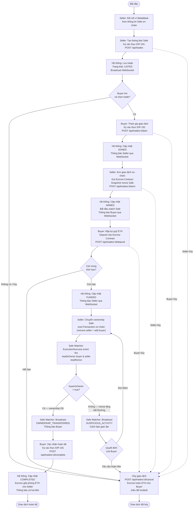

# Sơ Đồ Activity — Vòng Đời Giao Dịch Safe

Trả lời câu hỏi: **Nghiệp vụ chính chạy thế nào từ đầu đến cuối?**

## Chú giải

| Ký hiệu | Ý nghĩa |
|---------|--------|
| Hình chữ nhật thường | Hành động của người dùng hoặc hệ thống |
| Hình thoi `{ }` | Điểm quyết định (decision) |
| Oval `([ ])` | Trạng thái bắt đầu / kết thúc |
| Mũi tên đứt `-.->` | Luồng hủy (có thể xảy ra tại nhiều điểm) |
| `Safe Watcher` | Background service, không có user interaction |
