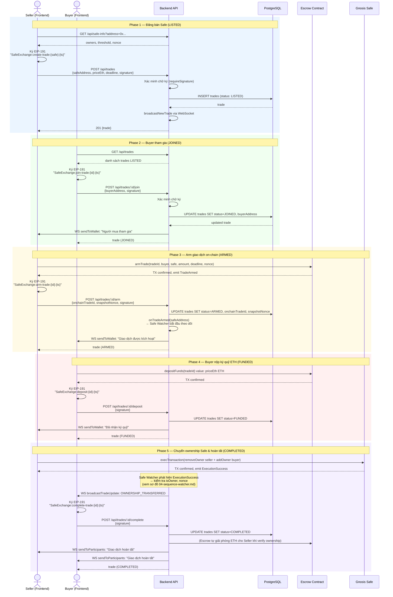

# Sơ Đồ Sequence — Luồng Giao Dịch

Trả lời câu hỏi: **Frontend, Backend, DB, Blockchain tương tác theo thứ tự nào trong một giao dịch hoàn chỉnh?**



## Ghi chú xác thực

Mọi endpoint ghi đều yêu cầu `signature` + `signedMessage` trong body. Backend gọi `requireSignature()` để xác minh:

```
signedMessage = "SafeExchange:{action}:{resource}:{isoTimestamp}"
```

| Action | Người ký | Resource |
|--------|---------|----------|
| `create-trade` | sellerAddress | safeAddress |
| `join-trade` | buyerAddress | tradeId |
| `arm-trade` | sellerAddress | tradeId |
| `deposit` | buyerAddress | tradeId |
| `complete-trade` | buyer hoặc seller | tradeId |
| `cancel-trade` | buyer hoặc seller | tradeId |
