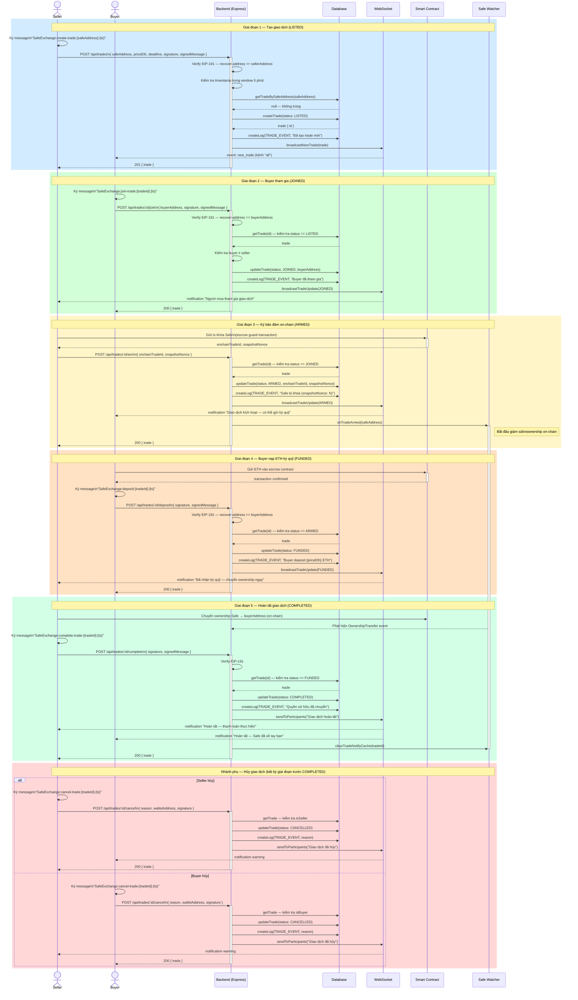

# Sequence Diagram — Phân hệ Giao dịch Safe

> Tương ứng với **Use Case Phân rã 2: Phân hệ Giao dịch Safe**

Mô tả toàn bộ vòng đời giao dịch từ khi Seller tạo trade cho đến khi hoàn tất hoặc hủy.

---

