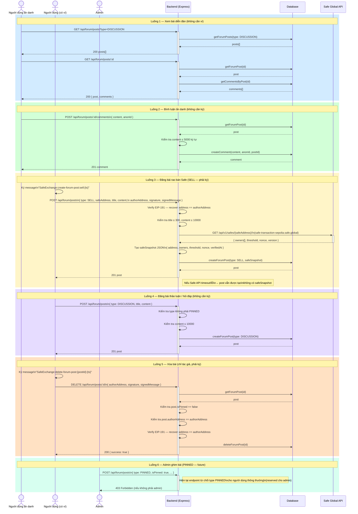

# Sequence Diagram — Phân hệ Diễn đàn

> Tương ứng với **Use Case Phân rã 3: Phân hệ Diễn đàn**

Mô tả các luồng tương tác với diễn đàn cộng đồng: xem bài, bình luận ẩn danh, đăng bài có ví, xóa bài.

---

