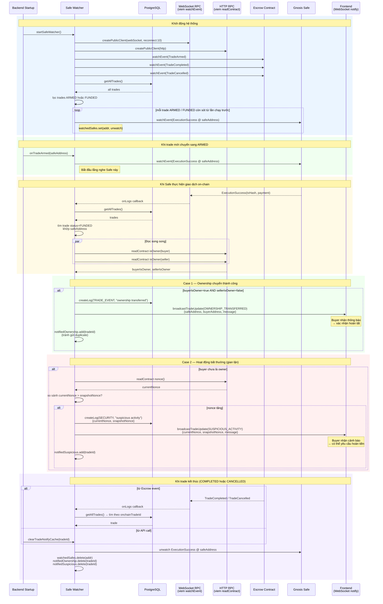

# Sơ Đồ Sequence — Safe Watcher

Trả lời câu hỏi: **Hệ thống phát hiện ownership transfer thành công hoặc gian lận như thế nào?**

> Safe Watcher chạy hoàn toàn ở backend — không có user interaction. Nó dùng WebSocket RPC để subscribe events và HTTP RPC để đọc trạng thái contract.

## Thiết kế quan trọng

| Quyết định | Lý do |
|-----------|-------|
| WebSocket RPC cho subscribe, HTTP RPC cho readContract | WS ổn định cho event stream; HTTP ổn định hơn cho query đơn lẻ |
| `notifiedOwnership` / `notifiedSuspicious` Set | Tránh gửi duplicate notification khi ExecutionSuccess fire nhiều lần |
| Recover ARMED/FUNDED trades khi startup | Đảm bảo không bỏ sót trade nếu server restart giữa chừng |
| Subscribe escrow events để auto add/remove Safe | Không cần polling DB định kỳ — hoàn toàn event-driven |
