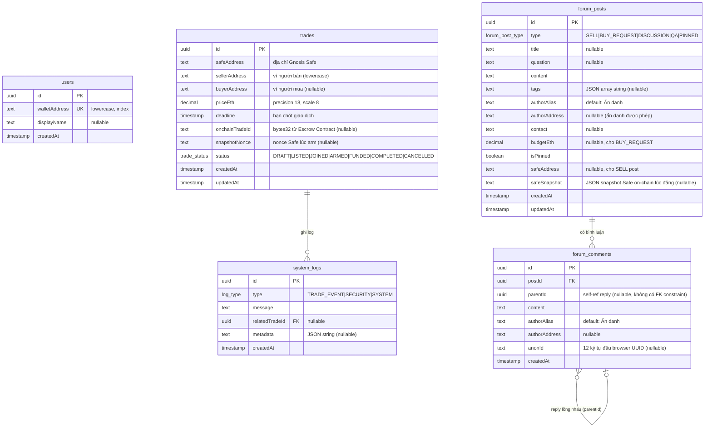

# Sơ Đồ ERD — Cơ Sở Dữ Liệu

Trả lời câu hỏi: **Dữ liệu được lưu như thế nào?**

## Quan hệ logic (không có FK trong DB)

| Trường | Bảng | Tham chiếu logic đến |
|--------|------|---------------------|
| `sellerAddress` | trades | users.walletAddress |
| `buyerAddress` | trades | users.walletAddress |
| `authorAddress` | forum_posts | users.walletAddress |
| `authorAddress` | forum_comments | users.walletAddress |

> Thiết kế cố ý **không dùng FK** cho wallet address vì người dùng có thể đăng bài ẩn danh mà không cần tạo tài khoản trước.

## Enum values

| Enum | Giá trị |
|------|--------|
| `trade_status` | `DRAFT`, `LISTED`, `JOINED`, `ARMED`, `FUNDED`, `COMPLETED`, `CANCELLED` |
| `log_type` | `TRADE_EVENT`, `SECURITY`, `SYSTEM` |
| `forum_post_type` | `SELL`, `BUY_REQUEST`, `DISCUSSION`, `QA`, `PINNED` |
