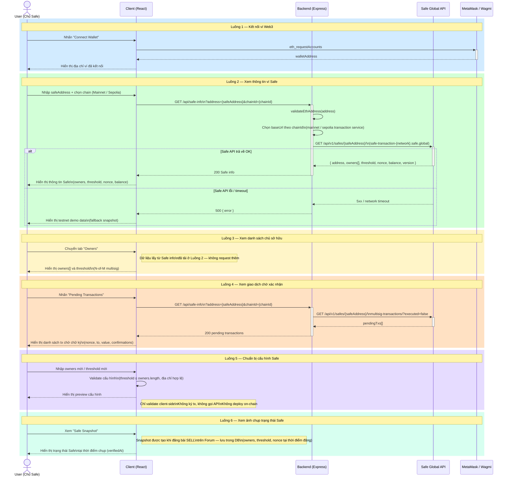

# Sequence Diagram — Phân hệ Quản lý Safe

> Tương ứng với **Use Case Phân rã 4: Phân hệ Quản lý Safe**

Mô tả luồng người dùng kết nối ví, tra cứu thông tin Safe thông qua backend proxy, và xem các trạng thái on-chain.

---

