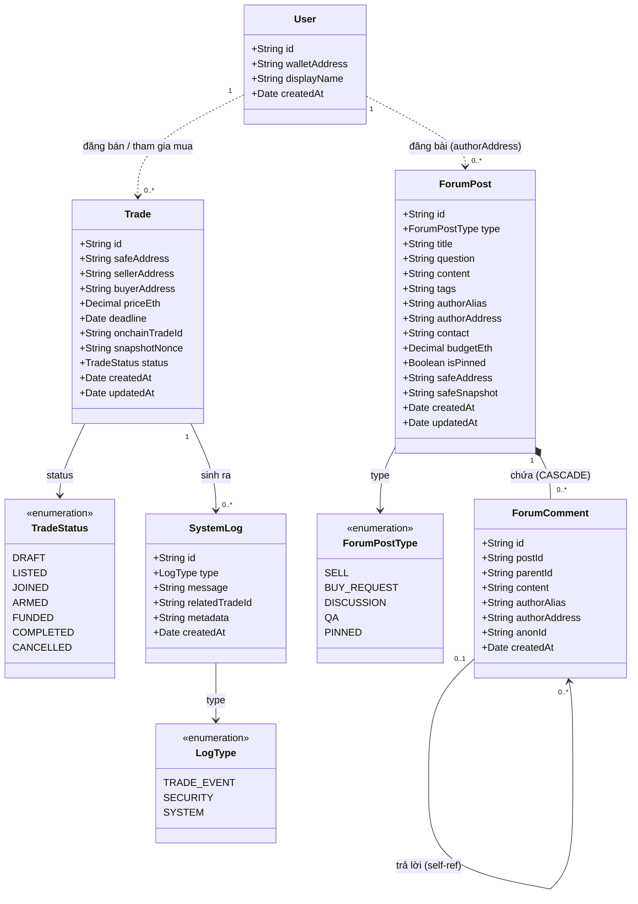
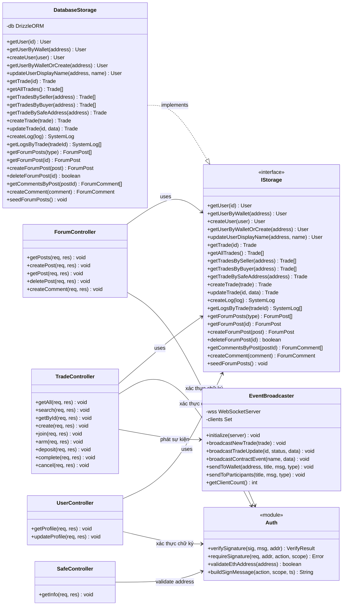

# Sơ đồ Lớp — WebSafeExchange

Gồm 2 phần: **Domain Model** (thực thể nghiệp vụ) và **Application Layer** (tầng ứng dụng).

---

## 1. Domain Model — Thực thể nghiệp vụ & quan hệ

---

## 2. Application Layer — Tầng ứng dụng

