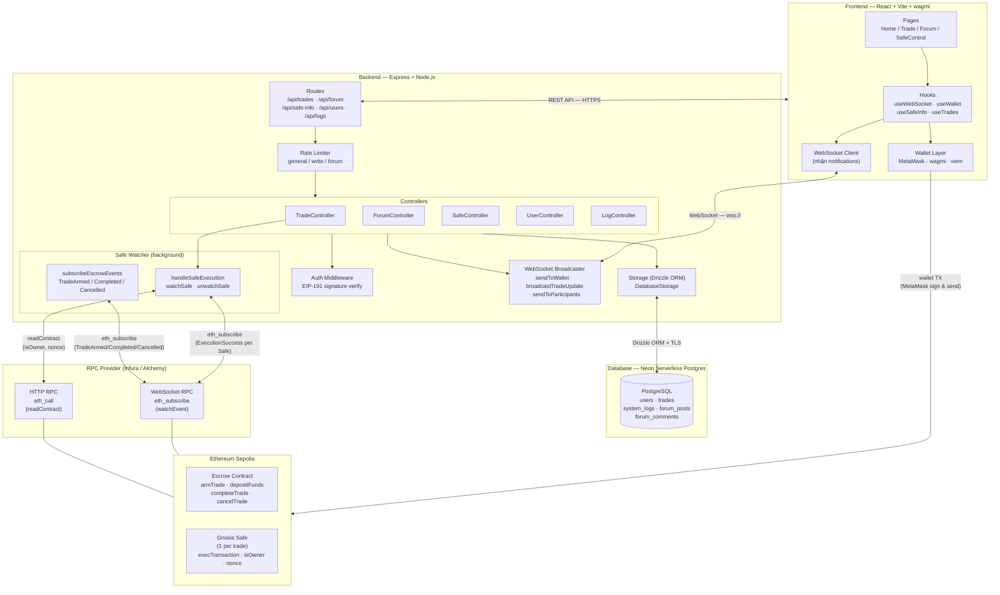

# Sơ Đồ Component — Kiến Trúc Hệ Thống

Trả lời câu hỏi: **Hệ thống gồm những phần nào và chúng liên kết với nhau ra sao?**



## Luồng dữ liệu chính

```
Browser (MetaMask) ──on-chain TX──▶ Escrow / Gnosis Safe
                                         │
                              Escrow emits event
                                         │
                    WS RPC ◀── eth_subscribe ──▶ Safe Watcher
                                         │
                    Safe Watcher ──notify──▶ WebSocket Broadcaster ──▶ Browser
```

## Giao thức liên lạc

| Kết nối | Giao thức | Ghi chú |
|---------|----------|---------|
| Frontend ↔ Backend | HTTPS REST | Rate-limited, CORS whitelist |
| Frontend ↔ Backend | WebSocket (wss://) | Persistent, send to wallet by address |
| Frontend → Blockchain | JSON-RPC (MetaMask) | Người dùng ký & broadcast TX |
| Safe Watcher → Blockchain | WS RPC (viem) | Subscribe events, reconnect 10 lần |
| Safe Watcher → Blockchain | HTTP RPC (viem) | readContract (stable hơn WS cho queries) |
| Backend → PostgreSQL | TCP + TLS | Drizzle ORM, Neon serverless |
