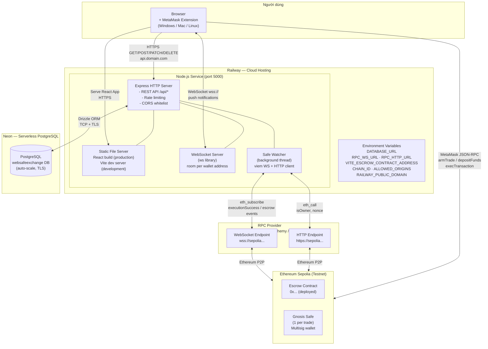

# Sơ Đồ Deployment

Trả lời câu hỏi: **Hệ thống được triển khai ở đâu?**

## Cấu hình môi trường

| Biến | Dùng cho |
|------|---------|
| `DATABASE_URL` | Kết nối Neon PostgreSQL |
| `RPC_WS_URL` | Safe Watcher subscribe events (wss://) |
| `RPC_HTTP_URL` | Safe Watcher readContract (https://) |
| `VITE_ESCROW_CONTRACT_ADDRESS` | Địa chỉ Escrow Contract trên Sepolia |
| `CHAIN_ID` | Chain ID (11155111 = Sepolia, 1 = Mainnet) |
| `ALLOWED_ORIGINS` | Danh sách origin được phép CORS |
| `RAILWAY_PUBLIC_DOMAIN` | Railway tự inject, dùng cho CORS default |

## Ghi chú triển khai

- Frontend và Backend **cùng một service** trên Railway — Express serve React build trong production
- Neon **auto-scale** serverless PostgreSQL — không cần quản lý instance
- Safe Watcher tự **recover** khi restart: đọc lại trades ARMED/FUNDED từ DB và re-subscribe
- Railway tự cấp **HTTPS/WSS** certificate — không cần cấu hình thêm
