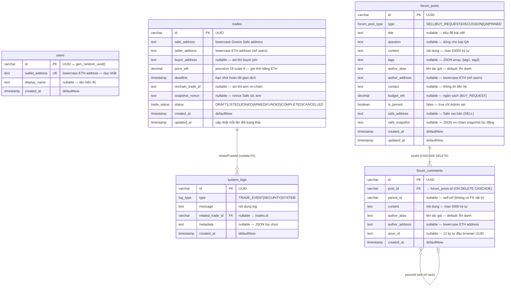

# ERD — Sơ đồ Quan hệ Cơ sở dữ liệu

> Database: **PostgreSQL** — ORM: **Drizzle ORM**
>
> Ghi chú: `sellerAddress`, `buyerAddress`, `authorAddress` là cột `text` tham chiếu ngữ nghĩa đến `users.walletAddress`, **không có FK vật lý** (Web3 identity — ví có thể tồn tại trước khi đăng ký profile).

---

---

## Ghi chú thiết kế

| Quyết định | Lý do |
|---|---|
| `wallet_address` là `UNIQUE` không phải PK | Cho phép hệ thống dùng UUID làm PK chuẩn, tránh phụ thuộc vào địa chỉ ví |
| Không có FK từ `trades` → `users` | Seller/buyer có thể giao dịch mà chưa tạo profile — identity qua chữ ký EIP-191 |
| `safe_snapshot` lưu JSON text | Tránh join phức tạp; snapshot chỉ đọc sau khi tạo |
| `tags` lưu JSON text | Linh hoạt thêm/bớt tag không cần migration schema |
| `parent_id` không có FK | Tránh circular FK; tính toàn vẹn kiểm soát ở tầng ứng dụng |
| `CASCADE DELETE` trên `forum_comments.post_id` | Xóa bài tự động xóa toàn bộ comment — đơn giản hóa logic xóa |
| `status` dùng PostgreSQL enum | Đảm bảo data integrity, không cần check constraint riêng |
